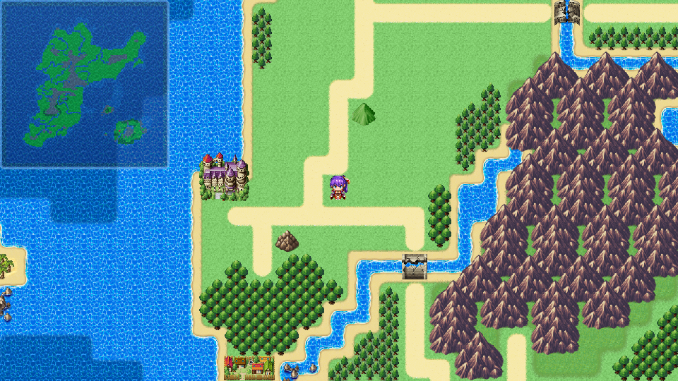
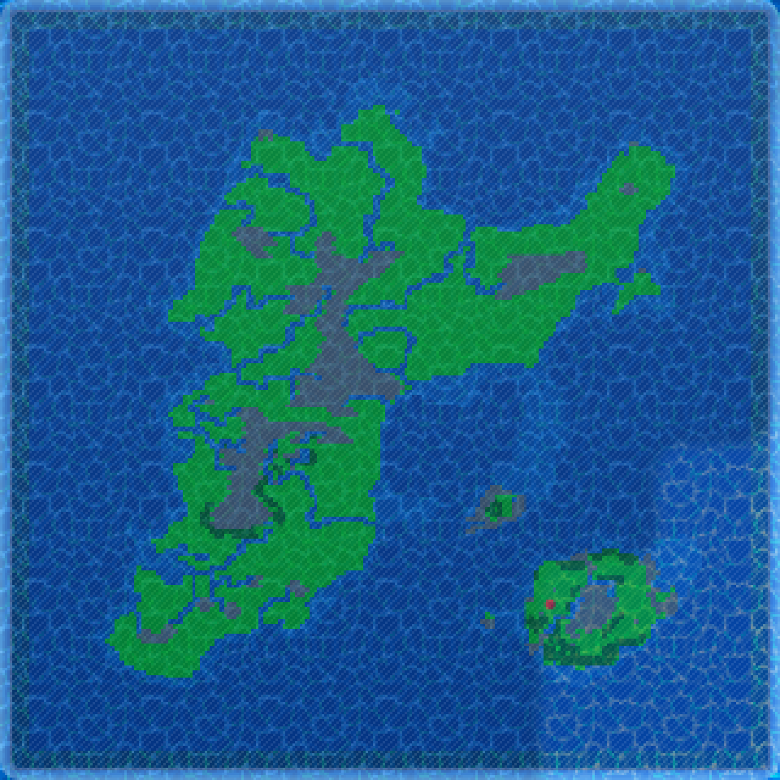
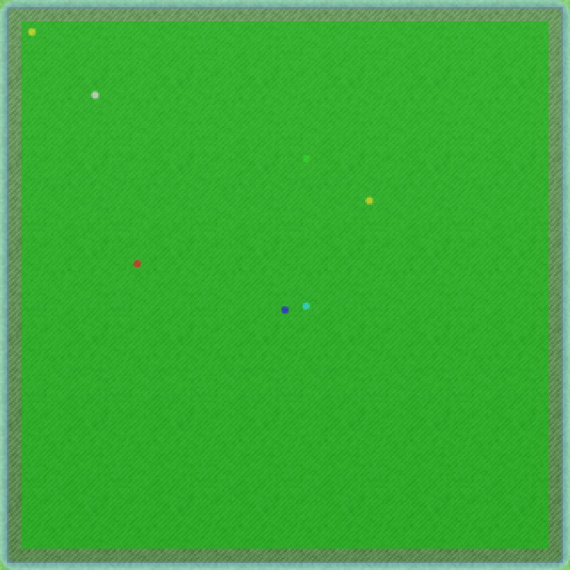

# N_Minimap
Adds a minimap to the game.

| Game UI               | Minimap                 |
| --------------------- | ----------------------- |
|  |  |

- Minimap transparency and tile colors are fully configurable.
- Minimap can be set to 3 different vertical positions (top, middle, bottom) and 3 different horizontal positions (left, middle, right), for a total of 9 possible positions.
- Minimap size is defined by vertical and horizontal screen percentage, and retains aspect ratio.
- Minimap can be set to be automatically hidden while events are running.
- Minimap can be shown or hidden via switch.
- Displays player position.
- Supports markers (to track quests, enemies, etc).  

  - Each map has its own markers.
  - Each marker can be given its own custom color.
  - Markers can track events, or can have their positions set via variables or static values.
  - Markers can be removed when no longer needed.
  - Markers can be added or removed for other maps.
  - Markers are retained in save game files.

| Project   | Latest release      |
| --------- | ------------------- |
| N_Minimap | [Download][release] |

[All RPG Maker plugins by Nolonar][hub]

## Compatibility
Tested and confirmed working:
- RPG Maker MZ

## Terms of Use
According to [LICENSE](LICENSE).

  [hub]: https://github.com/Nolonar/RM_Plugins
  [release]: https://github.com/Nolonar/RM_Plugins-Minimap/releases/latest/download/N_Minimap.js
